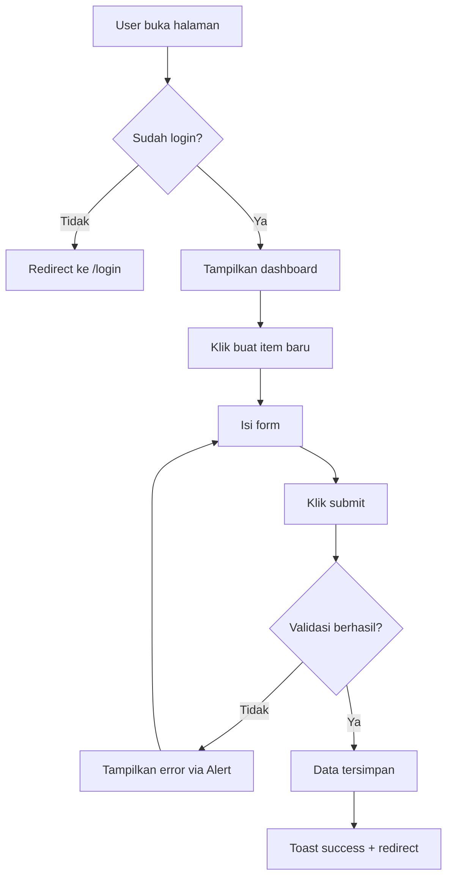
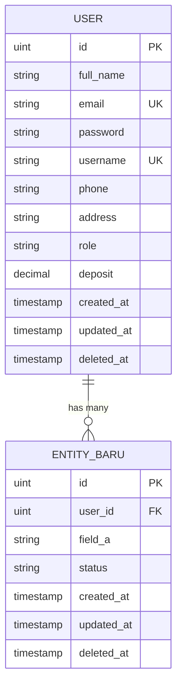

# Dokumentasi Pengembangan Produk

Direktori `docs/` berisi seluruh dokumentasi perencanaan dan pengembangan produk. Dokumentasi dibuat secara **bertahap** mengikuti alur kerja dua jalur:

```
                    ┌── UX Flow ── UI Spec ──────┐
         PRD ──────┤                              ├──→ Implementasi
                    └── ERD ────── API Contract ──┘
```

- **Jalur Frontend**: PRD → UX Flow → UI Spec
- **Jalur Backend**: PRD → ERD → API Contract

Kedua jalur bisa dikerjakan **paralel** karena sumber kebenarannya sama: **PRD**.

---

## Konteks Proyek

Dokumentasi ini digunakan dalam konteks **GOTS Monorepo Starter Kit** dengan tech stack:

| Layer    | Stack                                                                 |
|----------|-----------------------------------------------------------------------|
| Backend  | Go 1.25, Echo v4, GORM, PostgreSQL, JWT Auth, Swagger (swag)         |
| Frontend | React 19, TanStack Router (file-based), TanStack Query, Tailwind v4  |
| Tooling  | Vite 8, Biome (linter/formatter), Orval (API codegen), Nx, pnpm      |

Sesuaikan template di bawah dengan tech stack di atas saat menulis dokumentasi.

---

## Struktur Direktori

```
docs/
├── README.md                       # ← Kamu di sini
├── issue/
│   └── README.md                   # Template penulisan issue
├── <nama-fitur>/
│   ├── prd.md                      # 1. Product Requirements Document
│   ├── ux-flow.md                  # 2a. User Flow & Sitemap
│   ├── ui-spec.md                  # 2b. UI Specification
│   ├── erd.md                      # 3a. Entity Relationship Diagram
│   └── api-contract.md             # 3b. API Contract (RESTful)
└── <nama-fitur-lain>/
    └── ...
```

Setiap fitur/modul memiliki folder sendiri di bawah `docs/`.

---

## Alur Pembuatan Dokumentasi

### 1️⃣ PRD (Product Requirements Document)

> **Dibuat pertama kali.** PRD adalah single source of truth untuk scope fitur.

#### Cara Membuat PRD

Gunakan prompt berikut untuk men-generate PRD dari ide produk:

```
I have an idea for building a webapp/saas/etc. I need you to help me to create
the PRD for the idea. So the idea is:

" {masukkan ide produk di sini} "

And then draft me these:
- Product Overview
- Background Problem & Solution
- Features (Core, NTH (Nice to Have), PTH (Plan to Have))
- User Stories (role, action, goal)
- Reference
```

#### Struktur PRD

```markdown
# PRD: [Nama Fitur]

## Product Overview
Deskripsi singkat tentang produk/fitur yang akan dibangun.

## Background Problem & Solution
### Problem
Masalah apa yang dialami user saat ini.

### Solution
Bagaimana fitur ini menyelesaikan masalah tersebut.

## Features

### Core Features
Fitur utama yang **harus ada** di versi pertama (MVP).
- [ ] Fitur A
- [ ] Fitur B

### Nice to Have (NTH)
Fitur tambahan yang bagus jika ada, tapi tidak blocking untuk launch.
- [ ] Fitur C

### Plan to Have (PTH)
Fitur yang direncanakan untuk versi berikutnya.
- [ ] Fitur D

## User Stories
- Sebagai [role], saya ingin [action], agar [benefit].
- Sebagai [role], saya ingin [action], agar [benefit].

## Reference
Link referensi, kompetitor, inspirasi desain, dll.
```

---

## Jalur Frontend

### 2a️⃣ UX Flow

> **Di-generate dari PRD.** Fokus pada *bagaimana user menyelesaikan task*, bukan tampilan.

#### Aturan

- Harus traceable ke user stories dan features di PRD
- Gunakan Mermaid flowchart untuk diagram user flow
- Definisikan state halaman: empty, loading, error, success
- Pertimbangkan auth guard pattern yang sudah ada (`_authenticated` layout route)

#### Cara Generate

Berikan PRD sebagai konteks, lalu gunakan prompt:

```
Berdasarkan PRD berikut, buatkan UX Flow yang berisi:
- Sitemap (peta halaman dan hierarki)
- User flow diagram untuk setiap core feature (Mermaid flowchart)
- Navigation pattern (sidebar/tabs/breadcrumb/dll)
- State & edge cases per halaman (empty, loading, error, success)

Tech stack frontend: React 19 + TanStack Router (file-based routing) + TanStack Query.
Routing menggunakan layout routes (_authenticated.tsx sebagai auth guard).

PRD:
{paste isi prd.md}
```

#### Struktur UX Flow

````markdown
# UX Flow: [Nama Fitur]

> Berdasarkan: [link ke prd.md]

## Sitemap

```
/                           → Landing / redirect
├── /login                  → Halaman login
├── /register               → Halaman register
└── /_authenticated/        → Layout route (auth guard)
    ├── /                   → Dashboard utama
    ├── /[fitur]
    │   ├── /               → Daftar item
    │   ├── /new            → Buat item baru
    │   └── /$id            → Detail item
    └── /settings           → Pengaturan akun
```

## Navigation Pattern

- **Layout utama**: Sidebar (desktop) + Bottom nav (mobile)
- **Navigasi sekunder**: Breadcrumb di halaman detail
- **Auth guard**: `_authenticated.tsx` redirect ke `/login` jika belum login
- **Toast/Alert**: Menggunakan komponen Alert atom & Toast molecule

## User Flows

### Flow: [Nama Core Feature]



### Flow: [Nama Core Feature Lain]
...

## State per Halaman

### /[fitur] (Daftar Item)
| State   | Tampilan                                          |
|---------|---------------------------------------------------|
| Loading | Skeleton placeholder                              |
| Empty   | Ilustrasi + teks "Belum ada data" + tombol CTA    |
| Error   | Alert component (variant=error) + tombol retry     |
| Success | Tabel data + pagination                           |

### /[fitur]/new (Buat Item)
| State   | Tampilan                                          |
|---------|---------------------------------------------------|
| Default | Form kosong (FormField molecules)                 |
| Loading | Button disabled + spinner                         |
| Error   | Alert inline di atas form                         |
| Success | Toast "Berhasil dibuat" + redirect                |
````

---

### 2b️⃣ UI Spec

> **Di-generate dari UX Flow.** Fokus pada *tampilan konkret*: layout, komponen, dan interaksi detail.

#### Aturan

- Harus mengacu pada halaman dan flow yang sudah didefinisikan di UX Flow
- Gunakan komponen yang sudah tersedia di `src/components/` (Atomic Design)
- Komponen yang tersedia saat ini:
  - **Atoms**: `Alert`, `Button`, `Input`, `Label`
  - **Molecules**: `ConfirmDialog`, `FormField`, `Toast`
- Sertakan responsive behavior (desktop vs mobile)

#### Cara Generate

Berikan UX Flow sebagai konteks, lalu gunakan prompt:

```
Berdasarkan UX Flow berikut, buatkan UI Spec yang berisi:
- Layout per halaman (struktur grid, posisi komponen)
- Komponen yang digunakan per halaman
- Interaksi detail (apa yang terjadi saat klik, hover, submit)
- Responsive behavior (desktop vs mobile)

Kita menggunakan:
- React 19 + TanStack Router (file-based routing)
- Tailwind CSS v4 (utility-first, no config file)
- Lucide React icons
- Atomic Design: atoms (Alert, Button, Input, Label), molecules (ConfirmDialog, FormField, Toast)
- Feature-based structure: src/features/<nama>/components/

UX Flow:
{paste isi ux-flow.md}
```

#### Struktur UI Spec

````markdown
# UI Spec: [Nama Fitur]

> Berdasarkan: [link ke ux-flow.md]

## Layout Global

- **Desktop**: Sidebar 280px (kiri) + Content area (kanan)
- **Mobile**: Bottom navigation + hamburger menu
- **Auth Layout**: `_authenticated.tsx` sebagai wrapper layout

## Halaman: /[fitur]

### Layout
```
┌──────────────────────────────────────────┐
│  Header: "Judul Halaman"    [+ Buat Baru]│
├──────────────────────────────────────────┤
│  Search (Input atom)    Filter dropdown  │
├──────────────────────────────────────────┤
│  Table / Card list                       │
│  ┌──────┬────────┬────────┬──────────┐   │
│  │ ID   │ Nama   │ Status │ Aksi     │   │
│  ├──────┼────────┼────────┼──────────┤   │
│  │ #001 │ Item A │ ●Active│ [Detail] │   │
│  └──────┴────────┴────────┴──────────┘   │
├──────────────────────────────────────────┤
│  Pagination: < 1 2 3 ... 10 >            │
└──────────────────────────────────────────┘
```

### Komponen
| Komponen        | Tipe (Atomic)  | Keterangan                    |
|-----------------|----------------|-------------------------------|
| Header          | —              | Custom, flexbox               |
| Tombol Buat     | `Button` atom  | variant="primary", size="sm"  |
| Search          | `Input` atom   | placeholder="Cari..."         |
| Form field      | `FormField` mol| Label + Input + error msg     |
| Status feedback | `Alert` atom   | variant sesuai state          |
| Confirm action  | `ConfirmDialog`| Untuk aksi destruktif         |
| Notifikasi      | `Toast` mol    | Auto-dismiss success/error    |

### Interaksi
- **Klik "Buat Baru"** → Navigate via TanStack Router `navigate()`
- **Submit form** → TanStack Query `useMutation()` → Toast on success / Alert on error
- **Delete item** → ConfirmDialog → API call → refresh data via `invalidateQueries()`
- **Ketik di search** → Debounce 300ms, update query params

### Responsive
- **Desktop**: Tabel penuh dengan semua kolom
- **Mobile**: Card-based layout, kolom tersembunyi
````

---

## Jalur Backend

### 3a️⃣ ERD (Entity Relationship Diagram)

> **Di-generate dari PRD.** ERD dibuat berdasarkan fitur-fitur yang didefinisikan di PRD.

#### Aturan

- Setiap entitas harus bisa di-trace balik ke fitur tertentu di PRD
- Gunakan format Mermaid untuk diagram
- Sertakan daftar tabel beserta field, tipe data, dan relasi
- Model harus mengikuti konvensi base model yang ada:
  - `PrimaryKey` (ID uint, auto-increment)
  - `BaseModelTimeAt` (created_at, updated_at, deleted_at soft-delete)

#### Cara Generate

Berikan PRD sebagai konteks, lalu gunakan prompt:

```
Berdasarkan PRD berikut, buatkan ERD yang berisi:
- Mermaid ER diagram
- Deskripsi setiap entitas (field, tipe, constraint)
- Penjelasan relasi antar entitas

Model menggunakan konvensi GORM:
- PrimaryKey: uint auto-increment
- BaseModelTimeAt: created_at, updated_at, deleted_at (soft delete)
- Tabel existing: users (full_name, email, password, username, phone, address, role, deposit)

PRD:
{paste isi prd.md}
```

#### Struktur ERD

````markdown
# ERD: [Nama Fitur]

> Berdasarkan: [link ke prd.md]

## Diagram



## Deskripsi Entitas

### User (sudah ada)
| Field      | Type         | Constraint      | Keterangan           |
|------------|--------------|-----------------|----------------------|
| id         | uint         | PK, auto-inc    | Primary key          |
| full_name  | varchar(100) | NOT NULL        | Nama lengkap         |
| email      | varchar(100) | NOT NULL, UNIQUE| Email login          |
| password   | varchar(100) | NOT NULL        | Hashed password      |
| username   | varchar(50)  | NOT NULL, UNIQUE| Username unik        |
| phone      | varchar(15)  | NOT NULL        | Nomor telepon        |
| address    | text         | NOT NULL        | Alamat lengkap       |
| role       | varchar(20)  | DEFAULT customer| Role user            |
| deposit    | decimal(15,2)| DEFAULT 0       | Saldo deposit        |
| created_at | timestamp    | auto            | Waktu dibuat         |
| updated_at | timestamp    | auto            | Waktu diupdate       |
| deleted_at | timestamp    | nullable, index | Soft delete          |

### [Entity Baru]
| Field      | Type      | Constraint  | Keterangan        |
|------------|-----------|-------------|-------------------|
| ...        | ...       | ...         | ...               |
````

---

### 3b️⃣ API Contract

> **Di-generate dari ERD.** API mengikuti standar **RESTful HTTP**.

#### Aturan

- Endpoint mengikuti konvensi REST: `GET`, `POST`, `PUT/PATCH`, `DELETE`
- Base path: `/api` (sesuai konfigurasi Echo)
- URL menggunakan **kebab-case** dan **plural nouns**: `/api/users`, `/api/orders`
- Response menggunakan format JSON yang konsisten (lihat format di bawah)
- Request body divalidasi dengan `go-playground/validator`
- Endpoint yang membutuhkan auth menggunakan JWT Bearer token
- Swagger annotation wajib di setiap handler

#### Cara Generate

Berikan ERD sebagai konteks, lalu gunakan prompt:

```
Berdasarkan ERD berikut, buatkan API Contract RESTful yang berisi:
- Daftar endpoint per entitas (CRUD)
- Request parameters, body, dan response untuk setiap endpoint
- HTTP status codes
- Mana yang perlu JWT auth dan mana yang public

Tech stack: Go Echo v4, GORM, JWT auth via Bearer token.
Base path: /api
Existing endpoints:
- POST /api/users/register (public)
- POST /api/users/login (public)
- GET /api/users (auth required)

ERD:
{paste isi erd.md}
```

#### Struktur API Contract

````markdown
# API Contract: [Nama Fitur]

> Berdasarkan: [link ke erd.md]

## Base URL

```
/api
```

## Authentication

- Endpoint publik: register, login
- Endpoint protected: menggunakan JWT Bearer token di header `Authorization`
- Format: `Authorization: Bearer <token>`

## Endpoints

### [Entity]

#### List [Entity]
```
GET /api/[entities]
```

Headers:
```
Authorization: Bearer <token>
```

Query Parameters:
| Param  | Type   | Required | Keterangan           |
|--------|--------|----------|----------------------|
| page   | number | no       | Halaman (default 1)  |
| limit  | number | no       | Per page (default 10)|
| search | string | no       | Pencarian            |

Response `200 OK`:
```json
{
  "message": "Data retrieved successfully",
  "data": [
    {
      "id": 1,
      "field_a": "value",
      "created_at": "2026-01-01T00:00:00Z"
    }
  ]
}
```

#### Create [Entity]
```
POST /api/[entities]
```

Headers:
```
Authorization: Bearer <token>
```

Request Body:
```json
{
  "field_a": "value"
}
```

Validation Rules:
| Field   | Rules                  |
|---------|------------------------|
| field_a | required, min=3, max=100|

Response `201 Created`:
```json
{
  "message": "Data created successfully",
  "data": {
    "id": 1,
    "field_a": "value",
    "created_at": "2026-01-01T00:00:00Z"
  }
}
```

## HTTP Status Codes

| Code | Keterangan                           |
|------|--------------------------------------|
| 200  | OK — Request berhasil                |
| 201  | Created — Resource berhasil dibuat   |
| 400  | Bad Request — Validasi gagal         |
| 401  | Unauthorized — Token invalid/expired |
| 403  | Forbidden — Tidak punya akses        |
| 404  | Not Found — Resource tidak ditemukan |
| 500  | Internal Server Error                |

## Response Format

```json
// Success (single/list)
{
  "message": "Pesan deskriptif",
  "data": { ... }
}

// Error
{
  "message": "Pesan error yang jelas"
}
```
````

---

## Workflow Summary

```
┌─────────────────────────────────────────────────────────────────┐
│                                                                 │
│  1. IDE / KONSEP                                                │
│     Tulis ide produk/fitur                                      │
│                        ↓                                        │
│  2. PRD (prd.md)                                                │
│     Generate menggunakan prompt template                        │
│     Output: overview, problem, features, user stories           │
│                        ↓                                        │
│          ┌─────────────┴─────────────┐                          │
│          ↓                           ↓                          │
│  JALUR FRONTEND                JALUR BACKEND                    │
│                                                                 │
│  3a. UX FLOW (ux-flow.md)      3b. ERD (erd.md)                │
│      Input: PRD                    Input: PRD                   │
│      Output: sitemap,              Output: entitas,             │
│      user flow, states             relasi, diagram              │
│          ↓                           ↓                          │
│  4a. UI SPEC (ui-spec.md)      4b. API CONTRACT                 │
│      Input: UX Flow                (api-contract.md)            │
│      Output: layout,              Input: ERD                    │
│      komponen, interaksi           Output: endpoints,           │
│                                    request/response             │
│          ↓                           ↓                          │
│          └─────────────┬─────────────┘                          │
│                        ↓                                        │
│  5. IMPLEMENTASI                                                │
│     Backend: model → dto → repository → service → handler      │
│     Frontend: route → feature → component → API hook (Orval)   │
│                                                                 │
└─────────────────────────────────────────────────────────────────┘
```

---

## Tips

- **PRD dulu, baru yang lain.** Jangan langsung bikin ERD atau UI tanpa PRD. PRD adalah single source of truth untuk scope fitur.
- **Dua jalur bisa paralel.** UX Flow dan ERD bisa dikerjakan bersamaan karena keduanya bersumber dari PRD.
- **Satu folder per fitur.** Jangan campur dokumentasi fitur yang berbeda dalam satu file.
- **Gunakan checklist di PRD.** Tandai fitur yang sudah selesai diimplementasi dengan `[x]`.
- **Semua dokumen bisa di-generate.** Cukup berikan dokumen sebelumnya sebagai konteks ke prompt.
- **Iterasi.** Dokumentasi bukan batu — update seiring perkembangan fitur.
- **Swagger first.** Setelah implement handler, generate Swagger docs lalu jalankan Orval untuk auto-generate frontend API hooks.
- **Ikuti konvensi yang ada.** Model baru harus embed `PrimaryKey` dan `BaseModelTimeAt`. Handler baru harus punya Swagger annotation.

---

## Quick Reference: Urutan Generate

| # | Dokumen          | Input            | Prompt Keyword                                    |
|---|------------------|------------------|---------------------------------------------------|
| 1 | `prd.md`         | Ide produk       | "Create PRD: overview, problem, features, stories"|
| 2a| `ux-flow.md`     | `prd.md`         | "Buatkan UX Flow: sitemap, user flow, states"     |
| 2b| `ui-spec.md`     | `ux-flow.md`     | "Buatkan UI Spec: layout, komponen, interaksi"    |
| 3a| `erd.md`         | `prd.md`         | "Buatkan ERD: entitas, relasi, diagram Mermaid"   |
| 3b| `api-contract.md`| `erd.md`         | "Buatkan API Contract: CRUD endpoints, response"  |

---

## Referensi Cepat: Tech Stack

| Layer          | Detail                                                        |
|----------------|---------------------------------------------------------------|
| **Backend**    | Go 1.25 · Echo v4 · GORM · PostgreSQL · JWT · Swagger · Air  |
| **Frontend**   | React 19 · TanStack Router · TanStack Query · Vite 8         |
| **Styling**    | Tailwind CSS v4 · Lucide React                                |
| **Linting**    | Biome (format + lint)                                         |
| **API Codegen**| Orval (Swagger → React Query hooks)                           |
| **Monorepo**   | pnpm workspaces · Nx                                          |
